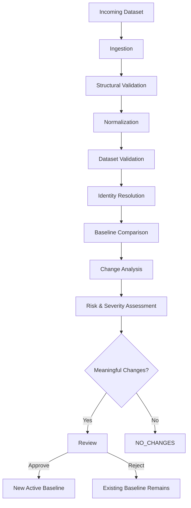

# DataParity

DataParity is a local-first structured data quality and change analysis platform designed for recurring CSV and XLSX datasets.

It helps users validate incoming datasets, normalize values, match records against an approved baseline, detect deterministic changes, analyze data-quality issues, and review changes before accepting a new dataset version.

## Why DataParity?

Recurring datasets often change between deliveries, but identifying meaningful changes manually can be time-consuming and error-prone.

DataParity is designed to make those changes explicit and reviewable while keeping customer dataset contents on the user's machine by default.

## Core Capabilities

* CSV and XLSX dataset ingestion
* Structural and schema validation
* Type-aware normalization
* Configurable record identity
* Deterministic record matching
* Added, removed, unchanged, and modified record detection
* Field-level change analysis
* Data-quality and validation checks
* Risk and severity assessment
* Dataset versioning
* Human review and approval workflows
* Local audit history
* Local artifact storage
* Exportable analysis results

## Architecture

DataParity follows a **local-first architecture**.

Core dataset processing does not depend on DataParity-operated cloud infrastructure. Customer dataset contents, comparison results, findings, review history, and source artifacts remain local by default.

The current architectural model consists of:

* **React + TypeScript** — presentation layer
* **FastAPI** — local application/API layer
* **Domain layer** — core DataParity business concepts and rules
* **Processing engine** — ingestion, normalization, validation, identity resolution, comparison, and analysis
* **SQLite** — local transactional application state
* **Local filesystem** — source datasets and generated artifacts
* **Licensing client** — communication with centralized licensing infrastructure

The analytical processing technology is intentionally not fixed yet and will be selected based on representative workloads and resource characteristics.

See [`docs/architecture.md`](docs/architecture.md) for the detailed architecture.

## Dataset Processing Flow

## Version Model

DataParity separates **processing outcomes** from **review lifecycle states**.

Processing outcomes include:

* `CHANGES_DETECTED`
* `NO_CHANGES`

Review lifecycle states include:

* `UNDER_REVIEW`
* `APPROVED`
* `REJECTED`

This distinction allows a successfully processed dataset with no meaningful
changes to bypass manual review while still retaining its processing history.

## Privacy Model

DataParity is designed so that customer dataset contents do not need to be uploaded to a DataParity-operated cloud service for core processing.

The centralized licensing service is intentionally separated from customer data processing.

Licensing infrastructure may store license and entitlement information, but it does not require access to customer datasets or comparison results.

## Technology

### Current

* React
* TypeScript
* Python
* FastAPI
* SQLite
* REST APIs

### Planned / Under Evaluation

The architecture intentionally leaves some implementation decisions open.

For analytical dataset processing, candidates include:

* DuckDB
* Polars
* pandas
* Other suitable local analytical technologies

The final choice will be based on representative DataParity workloads rather than being selected solely because of popularity or familiarity.

## Project Documentation

The repository contains architecture and design documentation alongside the implementation.

* [`docs/specification.md`](docs/specification.md) — product and functional requirements
* [`docs/architecture.md`](docs/architecture.md) — high-level architecture
* [`docs/decisions/`](docs/decisions/) — Architecture Decision Records

The documentation is maintained alongside the implementation so that architectural decisions can be revisited when real implementation constraints are discovered.

## Development Philosophy

DataParity is being developed with a strong emphasis on understanding the reasoning behind architectural and implementation decisions.

The goal is not only to build a working product, but to maintain a system whose architecture, trade-offs, and engineering decisions can be clearly explained and defended.

## Project Status

DataParity is currently under active development.

The architecture and product specification establish the initial MVP boundaries. Implementation decisions that depend on real workload characteristics will be validated during development rather than prematurely fixed.

## License

The project's licensing model will be defined before commercial distribution.
