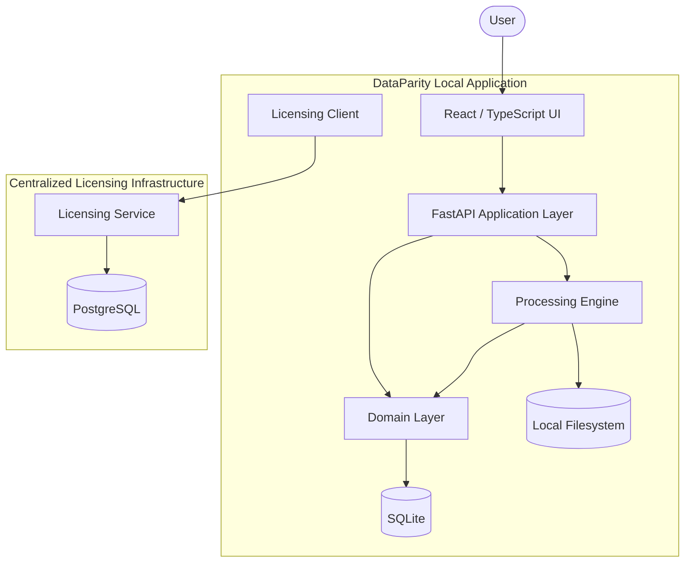
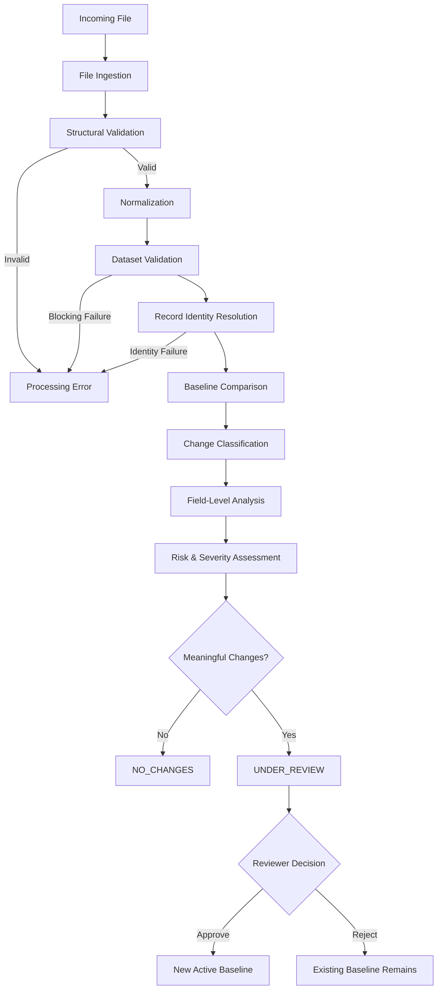
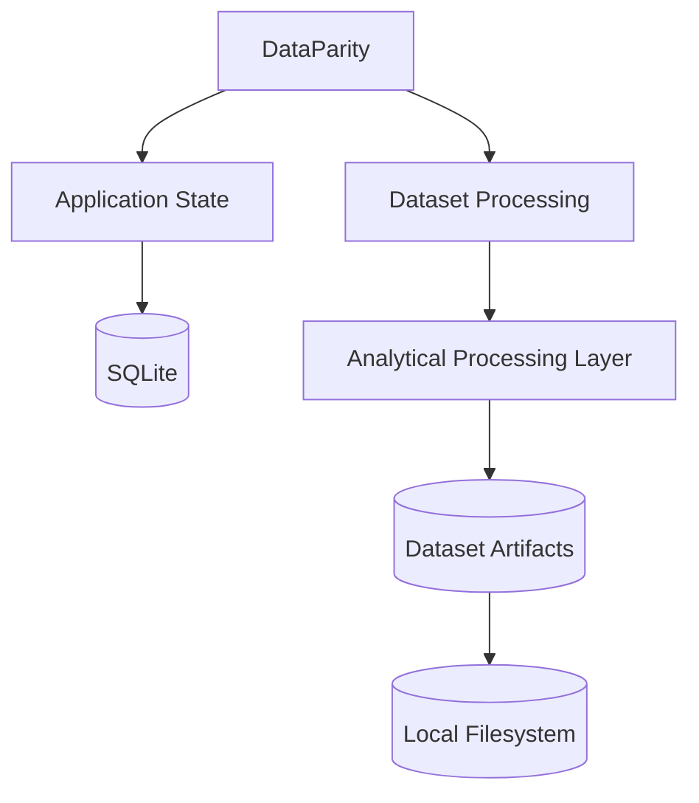
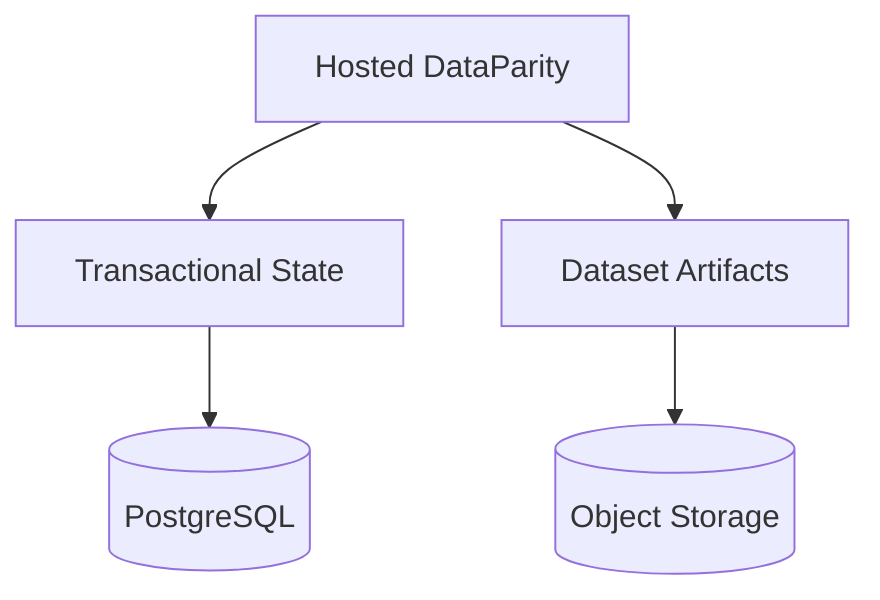
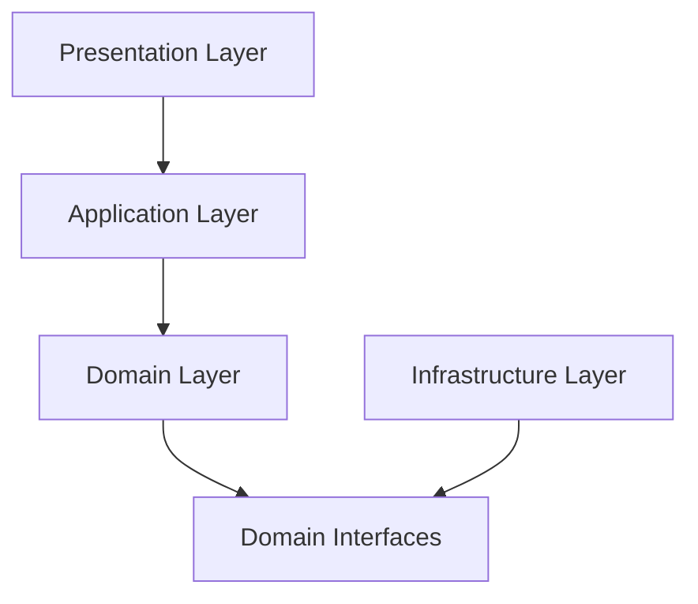
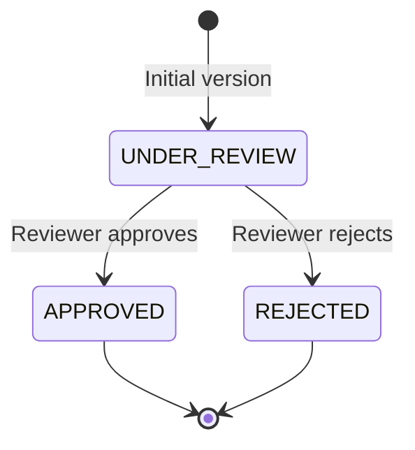
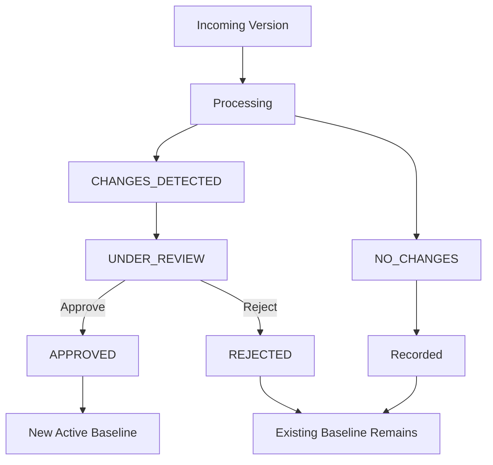
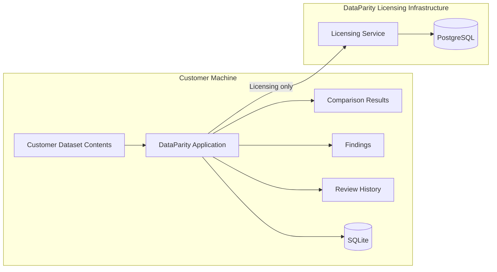
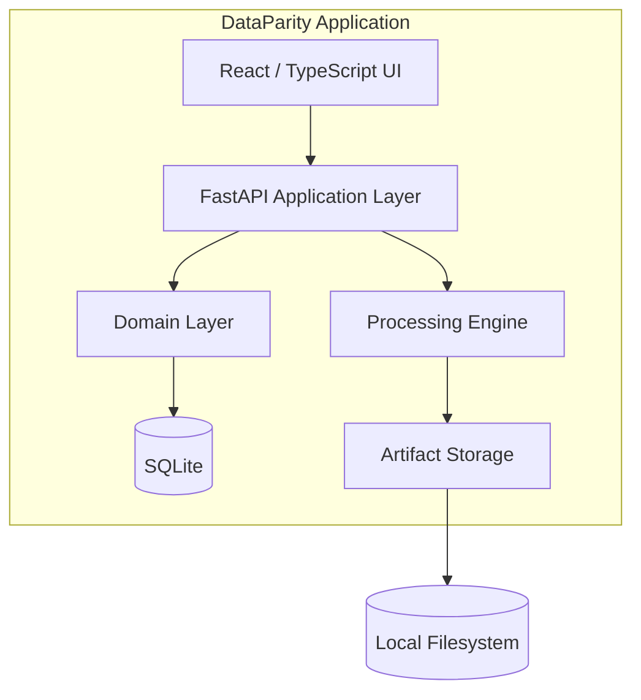
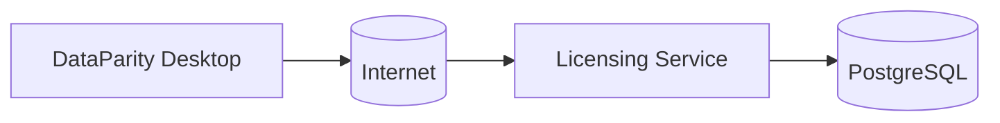

# DataParity High-Level Design

## 1. Purpose

This document describes the high-level architecture of DataParity, including
its major application boundaries, processing flow, persistence boundaries,
deployment model, and external service interactions.

The architecture is derived from the product specification and accepted
architecture decision records.

The HLD intentionally describes system responsibilities independently of
implementation details that have not yet been finalized.

## 2. Architectural Goals

DataParity architecture is designed around the following goals:

* Local-first processing of customer datasets.
* Plug-and-play operation for non-technical users.
* Preservation of customer data on the user's machine by default.
* Deterministic and explainable dataset comparison.
* Separation of dataset processing from presentation concerns.
* Explicit dataset versioning and review state.
* Safe handling of large datasets within available local resources.
* Replaceable infrastructure implementations where practical.
* Clear separation between customer data processing and licensing services.
* A future path to hosted and enterprise deployments without redesigning the
  core comparison model.

## 3. High-Level Architecture

At a high level, DataParity consists of a local application and a small set of
optional centralized services.

### 3.1 Local Application

The local DataParity application contains:

* Presentation layer.
* Application/API layer.
* Domain and processing engine.
* Transactional persistence.
* Dataset artifact storage.
* Licensing client.

All core dataset operations execute locally.

### 3.2 Centralized Services

Centralized services are separate from customer dataset processing.

The primary centralized service planned for the MVP commercial model is the
licensing service, responsible for license issuance, activation, renewal, and
entitlement management.

The licensing service must not require customer dataset contents.

### 3.3 System Component Architecture

The following diagram describes the primary component relationships rather than
a literal call-by-call execution sequence.

All dataset contents, comparison results, findings, review state, and source
artifacts remain within the local application boundary during normal MVP
processing.

Only licensing-related communication crosses the local application boundary.

## 4. Major Components

### 4.1 Presentation Layer

Provides the user interface for dataset configuration, processing status,
comparison results, findings, review, and version history.

### 4.2 Application/API Layer

Coordinates application workflows and acts as the boundary between the
presentation layer and the underlying domain and processing capabilities.

### 4.3 Domain Layer

Contains DataParity's core concepts and business rules, including datasets,
versions, identity configuration, changes, findings, and review decisions.

### 4.4 Processing Engine

Performs ingestion, normalization, validation, identity resolution, comparison,
field-level analysis, and severity assessment.

The processing engine remains independent of the presentation layer.

### 4.5 Transactional Persistence

Stores application metadata, configuration, version state, findings, review
decisions, and audit history.

SQLite is used for the local MVP.

### 4.6 Artifact Storage

Stores source files and generated file-based artifacts on the local filesystem.

### 4.7 Licensing Client

Communicates with the centralized licensing service for activation, renewal,
and license-related operations.

The licensing client does not participate in dataset processing.

### 4.8 Licensing Service

Provides centralized license issuance, activation, renewal, and entitlement
management.

The service does not require access to customer dataset contents.

## 5. End-to-End Processing Flow

DataParity processes each incoming dataset version through a deterministic
pipeline before presenting the resulting analysis to the reviewer.

### 5.1 Processing Pipeline

### 5.2 File Ingestion

The ingestion layer accepts supported input formats and converts them into a
common internal representation.

The ingestion layer is responsible for:

* Detecting the input format.
* Parsing supported files.
* Selecting the worksheet for XLSX input when required.
* Detecting structural problems.
* Performing only deterministic and safely verifiable repairs.
* Recording all repairs performed.
* Preserving the original source file.

The ingestion layer does not determine whether business-level data changes
are acceptable.

### 5.3 Structural Validation

Structural validation determines whether the incoming file can safely be
processed.

Validation includes checks such as:

* Empty or unusable input.
* Invalid file structure.
* Duplicate column names.
* Unrecoverable encoding or formatting problems.
* Missing required dataset structure.
* Unsupported file format.

Recoverable issues may be repaired according to the rules defined in the
product specification.

Unrecoverable issues produce an actionable processing error and do not create
a reviewable dataset version.

### 5.4 Normalization

Normalization converts equivalent representations into a consistent form for
comparison.

Normalization is type-aware and must not change the semantic meaning of a
value.

Examples may include:

* Insignificant whitespace normalization.
* Compatible formatting normalization.
* Data-type-specific representation normalization.

Both raw source values and normalized values remain available for analysis and
review.

### 5.5 Dataset Validation

After structural processing and normalization, DataParity validates the
dataset against its configured dataset definition.

This includes validation of:

* Required columns.
* Configured record-identity fields.
* Record-identity uniqueness.
* Expected data types.
* Configured validation rules.

A dataset that cannot establish reliable record identity cannot proceed to
normal comparison.

### 5.6 Record Identity Resolution

DataParity uses the configured record identity to match incoming records
against records in the active approved baseline.

The identity may consist of:

* A single column.
* Multiple columns forming a composite key.

Record matching is performed using normalized identity values while preserving
the original values for review.

### 5.7 Baseline Comparison

The incoming dataset is compared against the latest approved dataset version.

Each record is classified as:

* `ADDED`
* `REMOVED`
* `UNCHANGED`
* `MODIFIED`

Record ordering is not considered part of record identity.

### 5.8 Field-Level Analysis

Modified records are analyzed at the individual field level.

Each field change records:

* Record identity.
* Field name.
* Previous raw value.
* Incoming raw value.
* Previous normalized value.
* Incoming normalized value.
* Change type.
* Derived change information where applicable.

Derived information may include:

* Absolute difference.
* Percentage difference.
* Directional change.
* Date interval.

### 5.9 Risk and Severity Assessment

DataParity evaluates observed changes using configured validation and business
rules.

The analysis layer may identify potentially risky or significant changes.

Risk assessment describes the potential impact of observed changes. It does not
automatically make the final approval or rejection decision.

The reviewer remains the final authority.

### 5.10 Review

The reviewer receives the analysis and can inspect:

* Dataset-level changes.
* Schema changes.
* Record-level changes.
* Field-level changes.
* Validation issues.
* Risk and severity findings.
* Repairs performed during ingestion.

The reviewer can approve or reject the incoming dataset version.

A version with blocking validation or processing failures is not considered
ready for review and cannot be approved.

### 5.11 Approval

When a version is approved:

* The version becomes the active approved baseline.
* Its review decision is recorded.
* Associated analysis and audit information are retained.

### 5.12 Rejection

When a version is rejected:

* The existing approved baseline remains unchanged.
* The rejected version remains available for historical inspection.
* The review decision is recorded.

### 5.13 No-Change Processing

If validation and normalization determine that the incoming dataset contains no
meaningful schema, record, or field differences from the active approved
baseline, the version is classified as `NO_CHANGES`.

A no-change version does not require manual review.

The submitted version and processing result remain recorded for historical
purposes.

## 6. Persistence and Data Boundaries

DataParity separates application state, dataset artifacts, analytical
processing data, and licensing information.

The separation is intended to keep customer dataset contents local while
allowing centralized commercial infrastructure to operate independently.

### 6.1 Transactional Application State

The local MVP uses SQLite for transactional application state.

SQLite stores metadata and state required to operate the DataParity application,
including:

* Dataset definitions.
* Dataset versions and their lifecycle states.
* Record-identity configuration.
* Validation and business-rule configuration.
* Review decisions.
* Findings and analysis metadata.
* Processing status.
* Repair records.
* Audit events.
* Application configuration.

SQLite stores application state rather than serving as the primary analytical
engine for large dataset comparisons.

### 6.2 Dataset Artifacts

Original input files remain on the user's machine.

The filesystem is responsible for storing file-based artifacts such as:

* Original CSV files.
* Original XLSX files.
* Repaired or normalized artifacts when retention is required.
* Generated reports and exports.
* Other processing artifacts where file storage is appropriate.

The original source file is never modified in place.

Each stored artifact must be associated with the corresponding dataset version
through application metadata.

### 6.3 Analytical Processing

The analytical processing layer is responsible for executing operations over
dataset contents required for comparison and analysis.

The implementation technology is intentionally not fixed at the HLD level.

The analytical implementation must:

* Support the required comparison operations.
* Handle datasets within available local system resources.
* Avoid unnecessary full in-memory loading where an appropriate processing
  strategy supports incremental or out-of-core execution.
* Preserve deterministic comparison results.
* Remain separated from the domain model through a defined processing
  boundary.

The analytical technology will be selected after representative workload
evaluation and benchmarking.

### 6.4 Separation of Transactional and Analytical State

Transactional application state and analytical dataset processing have different
responsibilities.

The architecture therefore avoids treating the analytical dataset itself as
ordinary application metadata.

Conceptually:

The exact mechanism used to expose dataset artifacts to the analytical layer
is an implementation detail and must not leak into the domain layer.

### 6.5 Licensing Data Boundary

Licensing infrastructure is separate from customer dataset processing.

The centralized licensing service may store:

* License records.
* Product information.
* License terms.
* Activation records.
* Renewal information.
* License status.

The licensing service must not require customer dataset contents.

A local DataParity installation may communicate with the licensing service for
activation, renewal, or other explicitly defined licensing operations.

Core dataset ingestion, comparison, analysis, review, and export must remain
functional without continuous access to the licensing service while the local
license is valid.

### 6.6 Future Hosted Deployment

A future hosted or enterprise deployment may replace local persistence with
centralized infrastructure.

The expected separation is:

The core domain model and comparison concepts should remain independent of the
specific persistence technology.

### 6.7 Customer Data Isolation

Customer dataset contents must remain logically separate from licensing
information.

Licensing identifiers must not be used as substitutes for dataset identity.

The architecture must avoid sending dataset contents, comparison results, or
review findings to the licensing service unless a future product decision
explicitly introduces such functionality.

## 7. Component Responsibilities and Interfaces

DataParity is organized around explicit responsibilities and boundaries rather
than around individual framework features.

The processing and domain components must remain independent of the user
interface and specific persistence implementations wherever practical.

### 7.1 Presentation Layer

The presentation layer is responsible for providing the user interface for
DataParity.

Responsibilities include:

* Dataset creation and configuration.
* File selection and import initiation.
* Displaying validation results.
* Displaying schema differences.
* Displaying record-level changes.
* Displaying field-level changes.
* Displaying risk and severity findings.
* Providing review actions.
* Displaying dataset version history.
* Displaying processing and error states.

The presentation layer must not contain dataset comparison or business-rule
logic.

### 7.2 Application/API Layer

The application layer coordinates user actions and application workflows.

Responsibilities include:

* Receiving requests from the presentation layer.
* Loading the relevant dataset and configuration.
* Starting ingestion and processing workflows.
* Coordinating comparison and analysis.
* Persisting processing results.
* Managing dataset lifecycle transitions.
* Applying review decisions.
* Producing responses suitable for the presentation layer.

The application layer coordinates domain operations but should not implement
low-level file parsing or analytical algorithms directly.

### 7.3 Domain Layer

The domain layer represents DataParity's core concepts and business rules.

Core domain concepts include:

* Dataset.
* Dataset version.
* Record identity.
* Schema.
* Record change.
* Field change.
* Finding.
* Review decision.
* Validation rule.
* Processing result.

The domain layer defines business invariants such as:

* A dataset has one active approved baseline.
* A rejected version does not replace the active baseline.
* Record identity must be established before comparison.
* A review decision determines whether an incoming version becomes the new
  baseline.
* No-change versions do not require manual review.

The domain layer must not depend directly on React, FastAPI, SQLite,
PostgreSQL, or a specific analytical engine.

### 7.4 Ingestion Component

The ingestion component is responsible for converting supported source files
into a representation that can be validated and processed.

Responsibilities include:

* Format detection.
* CSV parsing.
* XLSX parsing.
* Worksheet selection.
* Structural inspection.
* Safe deterministic repairs.
* Repair reporting.
* Source artifact preservation.

The ingestion component must not make business-level approval decisions.

### 7.5 Normalization Component

The normalization component converts raw values into comparison-ready
representations according to configured or inferred data types.

Responsibilities include:

* Type-aware normalization.
* Representation normalization.
* Whitespace handling where configured.
* Preservation of raw source values.

Normalization must not silently change the semantic meaning of a value.

### 7.6 Validation Component

The validation component determines whether a dataset satisfies structural
and configured validation requirements.

Responsibilities include:

* Schema validation.
* Required-column validation.
* Data-type validation.
* Record-identity validation.
* Uniqueness validation.
* Configured business-rule validation.

Validation results must be represented as structured findings rather than only
as human-readable error strings.

### 7.7 Identity Component

The identity component resolves record identity according to the configured
record key.

Responsibilities include:

* Loading the configured identity definition.
* Constructing normalized record identities.
* Detecting duplicate identities.
* Matching records across versions.
* Reporting identity-related problems.

Identity resolution must be deterministic.

### 7.8 Comparison Component

The comparison component determines how the incoming dataset differs from the
active approved baseline.

Responsibilities include:

* Matching records using resolved identity.
* Classifying records as added, removed, unchanged, or modified.
* Identifying modified records for field-level analysis.
* Detecting schema differences.
* Producing structured comparison results.

The comparison component describes observed differences and does not make the
final review decision.

### 7.9 Change Analysis Component

The change analysis component expands record-level differences into detailed
field-level observations.

Responsibilities include:

* Identifying changed fields.
* Recording previous and incoming values.
* Calculating derived change information where meaningful.
* Preserving normalized and raw values.
* Producing structured change facts for downstream analysis.

### 7.10 Risk and Severity Component

The risk and severity component evaluates observed changes against configured
validation and business rules.

Responsibilities include:

* Evaluating change facts.
* Applying configured rules.
* Assigning severity classifications.
* Producing explanations for findings.
* Identifying potentially significant or risky changes.

Risk assessment must remain separate from the review decision.

### 7.11 Review Component

The review component manages the human decision over an incoming dataset
version.

Responsibilities include:

* Presenting reviewable findings.
* Recording approval decisions.
* Recording rejection decisions.
* Transitioning dataset-version state.
* Preserving the review history.

The reviewer remains the final authority for accepting or rejecting changes.

### 7.12 Persistence Component

The persistence component provides storage interfaces for application state.

Responsibilities include:

* Dataset metadata persistence.
* Dataset-version persistence.
* Configuration persistence.
* Finding persistence.
* Review-decision persistence.
* Audit-event persistence.

The domain and application layers should depend on persistence interfaces
rather than directly on SQLite or PostgreSQL implementations.

### 7.13 Artifact Storage Component

The artifact-storage component provides access to source files and generated
file artifacts.

Responsibilities include:

* Storing source artifacts.
* Retrieving source artifacts.
* Associating artifacts with dataset versions.
* Storing generated reports and exports.
* Managing artifact metadata.

The component must preserve the distinction between application metadata and
large file-based artifacts.

### 7.14 Licensing Client

The local licensing client communicates with the centralized licensing
service when required.

Responsibilities include:

* License activation.
* License retrieval.
* License renewal.
* Local signature verification.
* Local expiration validation.
* Reporting license state to the application.

The licensing client must not be responsible for dataset processing.

### 7.15 Licensing Service

The licensing service is an external centralized service.

Responsibilities include:

* License issuance.
* License-term management.
* Activation management.
* Renewal management.
* License status management.
* Entitlement management.

The licensing service must not require access to customer dataset contents.

### 7.16 Component Dependency Rule

The intended dependency direction is:

Infrastructure implementations may depend on domain-defined interfaces, but the
domain must not depend on infrastructure implementations.

Processing capabilities are similarly hidden behind processing boundaries so
that the underlying technology can be selected or changed without changing the
domain model.

## 8. Dataset and Version State Model

DataParity treats a dataset as a logical collection of recurring data rather
than as an individual source file.

A dataset contains multiple versions over time. Each version represents a
specific submitted state of the dataset and retains its processing,
comparison, analysis, and review history.

### 8.1 Dataset

A dataset represents the logical data collection being monitored.

A dataset contains:

* Dataset identity.
* Dataset configuration.
* Record-identity configuration.
* Validation and business-rule configuration.
* Version history.
* The currently active approved baseline.

A dataset can have only one active approved baseline at a time.

### 8.2 Dataset Version

A dataset version represents one submitted state of a dataset.

A version maintains references to:

* Source artifact.
* Dataset configuration used for processing.
* Processing result.
* Validation results.
* Schema comparison.
* Record comparison.
* Field-level analysis.
* Risk and severity findings.
* Review decision.
* Audit history.

A version is immutable after processing and review decisions have been
recorded, except for explicitly defined administrative metadata.

### 8.3 Version Lifecycle State

Dataset versions use the following lifecycle states:

* `UNDER_REVIEW`
* `APPROVED`
* `REJECTED`

These states represent the review lifecycle and are mutually exclusive.

### 8.4 Processing Outcome

Processing produces a separate outcome that describes what DataParity found
during comparison.

A processing outcome may be:

* `CHANGES_DETECTED`
* `NO_CHANGES`

`NO_CHANGES` is therefore not a review state.

It indicates that the incoming version was successfully processed and that no
meaningful schema, record, or field differences were detected.

### 8.5 Under Review

`UNDER_REVIEW` indicates that the incoming version has been successfully
processed but requires a reviewer decision.

The version may contain:

* Schema changes.
* Record changes.
* Field changes.
* Risk and severity findings.

The active approved baseline remains unchanged while the version is under
review.

A version with blocking validation or processing failures does not enter
`UNDER_REVIEW`.

### 8.6 Approved

`APPROVED` indicates that the reviewer has accepted the incoming version.

When a version becomes approved:

* It becomes the active approved baseline.
* The previous baseline ceases to be the active baseline.
* The approval decision is recorded.
* The version's analysis and audit history remain available.

Only one version may be the active approved baseline at a time.

### 8.7 Rejected

`REJECTED` indicates that the reviewer has rejected the incoming version.

When a version is rejected:

* The active approved baseline remains unchanged.
* The rejected version remains available for historical inspection.
* The rejection decision is recorded.

### 8.8 No Changes

A version with the `NO_CHANGES` processing outcome:

* Does not require manual review.
* Does not replace the active baseline.
* Remains recorded for historical purposes.
* Retains its processing result and source-artifact relationship.

Because no reviewer decision is required, the version does not enter the
`UNDER_REVIEW` state.

### 8.9 Initial Version

The first version of a newly created dataset has no existing approved
baseline.

The initial version must pass ingestion and validation and must be explicitly
approved before becoming the first active baseline.

The initial version cannot produce a `NO_CHANGES` outcome because there is no
previous approved version against which it can be compared.

### 8.10 Version Transition Rules

For the initial version:

For subsequent versions, processing outcome and lifecycle state are separate:

A `NO_CHANGES` version does not create a new active baseline.

### 8.11 Baseline Selection

Every comparison must explicitly identify the approved version used as its
baseline.

A comparison must never silently compare against an arbitrary previous file.

The baseline reference must be retained with the comparison result so that
historical analysis remains reproducible.

### 8.12 Version Immutability

Once a dataset version has been processed, its comparison and analysis results
must be treated as immutable.

If processing rules or configuration change in the future, a new processing
operation or version must be created rather than silently rewriting historical
results.

This ensures that historical review decisions remain explainable and
auditable.

### 8.13 Auditability

Important version lifecycle events must produce audit events, including:

* Version creation.
* Processing completion.
* Automatic repair.
* Review initiation.
* Approval.
* Rejection.
* Baseline transition.

Audit records must retain sufficient information to reconstruct the lifecycle
of a dataset version.

## 9. Error Handling and Failure Boundaries

DataParity must fail safely and explicitly when a processing operation cannot be
completed reliably.

The system must never produce incomplete comparison results and present them
as successful analysis.

### 9.1 Error Categories

Errors are classified into the following broad categories:

* Ingestion errors.
* Structural validation errors.
* Dataset validation errors.
* Identity errors.
* Processing errors.
* Persistence errors.
* Artifact-storage errors.
* Licensing errors.
* Resource errors.

Errors should be represented as structured application errors with a stable
error category, actionable message, and relevant context.

### 9.2 Ingestion Failure

If a supported file cannot be parsed safely:

* Processing stops.
* No incomplete dataset version is created.
* The original source artifact remains untouched.
* The user receives an actionable explanation.

Recoverable ingestion problems may be repaired according to the rules defined
in the specification.

All repairs must be recorded.

### 9.3 Validation Failure

Validation failures prevent unreliable data from proceeding to comparison.

A validation failure must:

* Produce structured validation findings.
* Preserve the source artifact.
* Record the processing result.
* Prevent the version from becoming an approved baseline.

A blocking validation failure does not create an `UNDER_REVIEW` version.

### 9.4 Identity Failure

Record identity is fundamental to reliable comparison.

If DataParity cannot establish reliable record identity, comparison must not
proceed.

Examples include:

* Missing configured identity columns.
* Null identity values where prohibited.
* Duplicate identities.
* Incompatible identity data types.
* Identity configuration incompatible with the incoming schema.

The system must explain the identity problem rather than producing potentially
incorrect record-level changes.

### 9.5 Processing Failure

If normalization, comparison, change analysis, or severity assessment fails:

* The operation is marked unsuccessful.
* Partial analysis must not be presented as complete analysis.
* The active approved baseline remains unchanged.
* The failure is recorded for investigation.
* The user receives an actionable error.

### 9.6 Resource Failure

DataParity must operate within the available resources of the user's machine.

Resource failures may include:

* Insufficient memory.
* Insufficient disk space.
* Processing timeouts.
* Operating-system resource limits.

The system must fail gracefully rather than intentionally exhausting system
resources.

Where possible, the application should provide actionable information such as
the failed processing stage and the type of resource constraint encountered.

A resource failure must never result in a partially accepted baseline.

### 9.7 Persistence Failure

If application state cannot be persisted reliably:

* The related operation must not be reported as successfully completed.
* The active approved baseline must remain unchanged unless the baseline
  transition has been durably committed.
* The user must receive an actionable error.
* The system must preserve consistency between application state and dataset
  artifacts as far as possible.

Baseline transitions must be atomic from the application's perspective.

### 9.8 Artifact Storage Failure

If a required source artifact or generated artifact cannot be stored or
retrieved:

* The affected operation must fail safely.
* The system must not create references to nonexistent artifacts.
* The user must receive an actionable error.

### 9.9 Licensing Failure

Licensing failures are separate from dataset-processing failures.

Examples include:

* Licensing service unavailable.
* Activation failure.
* Invalid license signature.
* Expired license.
* Renewal failure.

A valid locally stored license must allow the core application to continue
operating offline.

Licensing service availability must not become a dependency for ordinary
dataset processing during a valid license period.

### 9.10 Error Recovery

Where safe recovery is possible, DataParity should allow the user to correct
the underlying problem and retry processing.

Retries must not silently mutate the existing approved baseline.

Each retry should produce a new processing attempt associated with the relevant
dataset version.

### 9.11 Logging

Application logs must provide sufficient diagnostic information for
troubleshooting without unnecessarily exposing customer dataset contents.

Logs should prefer:

* Dataset identifiers.
* Version identifiers.
* Processing stage.
* Error category.
* Operation identifiers.
* Timing information.
* Diagnostic metadata.

Raw dataset values must not be written to logs by default.

## 10. Security and Privacy

DataParity is designed around a local-first privacy model. Customer dataset
contents remain on the user's machine by default and are not required to be
sent to DataParity-operated infrastructure for core processing.

### 10.1 Data Boundary

Customer dataset contents, comparison results, findings, review decisions, and
source artifacts remain local in the MVP.

The licensing service operates independently and must not require access to
customer dataset contents.

### 10.2 Local Data Protection

Local application data should use appropriate operating-system and filesystem
security controls.

Where sensitive application credentials or secrets are required, DataParity
should use platform-provided secure credential storage rather than storing
secrets in plaintext configuration files.

### 10.3 License Security

License entitlements are digitally signed.

The DataParity client contains the public key required to verify signatures.

The private signing key is never distributed with the application.

The client must reject licenses whose signatures cannot be successfully
verified.

### 10.4 Network Communication

Network communication is limited to services that explicitly require it.

For the MVP, the primary external communication is licensing-related.

All licensing communication must use secure transport.

Core dataset processing must not require continuous network connectivity.

### 10.5 Secret Management

Secrets must not be embedded in the application source code.

Licensing-service credentials, signing keys, and other server-side secrets must
remain exclusively within the appropriate server-side infrastructure.

The client application must never contain credentials that provide authority
to issue or modify licenses.

### 10.6 Privacy-Preserving Diagnostics

Diagnostic information must avoid unnecessary customer data exposure.

Telemetry, if introduced in the future, must be explicitly designed so that
customer dataset contents are not transmitted unintentionally.

The MVP does not require customer dataset telemetry for core functionality.

### 10.7 Security Boundary

The primary security boundary is:

The licensing boundary must not become a data-processing boundary.

## 11. Deployment and Runtime Architecture

The MVP is distributed as a local application intended to be usable by
non-technical users without requiring separate installation or management of
development infrastructure.

### 11.1 Local Runtime

The local DataParity runtime consists conceptually of:

The application is responsible for coordinating all core dataset operations
locally.

### 11.2 Packaging

The final distribution should package the required runtime components so that
the user does not need to separately install Python, Node.js, database
servers, or development tooling.

The exact packaging mechanism is an implementation decision and remains
separate from the architectural model.

### 11.3 Local Licensing Client

The local application contains a licensing client responsible for communicating
with the centralized licensing service when required.

The licensing client performs local license verification after receiving a
signed license entitlement.

### 11.4 Licensing Service

The centralized licensing service is independently deployed from the DataParity
desktop application.

Conceptually:

The licensing service may later integrate with payment infrastructure without
requiring changes to the local dataset-processing architecture.

### 11.5 Future Hosted Deployment

Future hosted or enterprise deployments may introduce centralized application
services and storage.

Such deployments may replace or supplement:

* Local SQLite.
* Local artifact storage.
* Local processing.

The core domain concepts and comparison model should remain independent of
these deployment decisions.

## 12. Open Architectural Decisions

The following decisions are intentionally not finalized at the HLD level.

### 12.1 Analytical Processing Technology

The analytical processing implementation has not yet been selected.

Candidates may include:

* DuckDB.
* Polars.
* pandas.
* Other suitable local analytical technologies.

The final selection will be based on representative DataParity workloads,
including memory usage, processing performance, comparison capabilities,
implementation complexity, and resource behavior.

### 12.2 Application Packaging

The exact desktop packaging mechanism has not yet been finalized.

The selected approach must provide a reliable plug-and-play installation
experience without requiring users to manage development runtimes.

### 12.3 License Activation Policy

The exact activation model, including device limits, transfer behavior,
offline grace periods, and renewal behavior, remains to be finalized during
licensing implementation.

### 12.4 System Clock Manipulation

The exact strategy for handling significant local system-clock manipulation
remains an implementation decision.

The licensing model must balance offline usability with reasonable protection
against trivial expiration bypass.

### 12.5 Hosted Architecture

Hosted and enterprise deployment architecture remains outside the MVP
implementation scope.

The local-first MVP architecture must nevertheless preserve boundaries that
allow future hosted deployment without redesigning the core comparison model.
